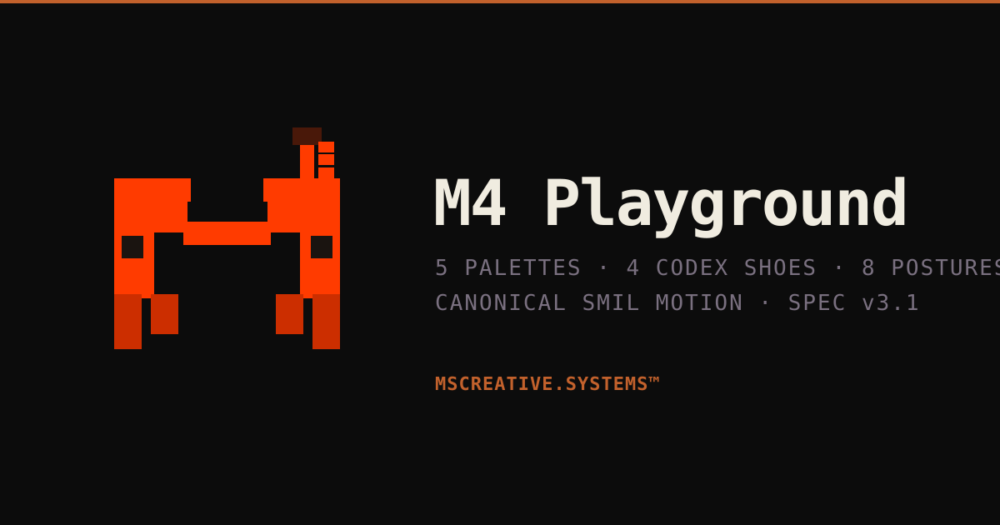

# M4 Playground

Interactive playground for the **M4 mascot** — the rect-only pixel-art mascot of
MSCREATIVE.SYSTEMS™. Render M4 live across palettes, Codex shoes, and postures,
inspect the canonical SVG, and copy it straight from the page.



## Features

- **5 palettes** — Dark · Orange · Cream · Mono · Nocturne
- **4 Codex shoes** — Neuro · Style · Design · Execution, with pixel-art patterns
- **8 canonical postures** — Idle · Working · Happy · Done · Reading · Walk · Dance · Vibing
- **Codex eyes** toggle, **grid overlay**, live **resize** (24 → 400px)
- **Canonical SMIL animations** with an on/off toggle
- **XML viewer** with copy-to-clipboard — what you see is what you copy
- **Scenes** page — M4 with laptop / phone props and Nocturne ambient
- **Spec** page — palette + Codex Shoes reference tables

Every coordinate, color, and animation value is copied verbatim from the M4
**SPEC v3.1**. No reinvented geometry, no raster images — all SVG `<rect>`.

## Stack

Next.js (App Router) · TypeScript · Tailwind CSS 3 · Radix UI primitives ·
inline SVG with SMIL · deployed on Vercel.

## Run locally

```bash
pnpm install
pnpm dev
```

Open [http://localhost:3000](http://localhost:3000).

```bash
pnpm build   # production build
```

## Architecture

```
lib/
  palettes.ts   5 palettes (SPEC §16 + §19)
  codex.ts      4 Codex shoes + 9-state table (SPEC §16.5, §18)
  postures.ts   8 postures (SPEC §5, §5.X)
  motion.ts     SMIL timing (SPEC §6-§9)
  scenes.ts     literal laptop / phone scene XML (SPEC §10-§11)
  m4/           SVG builders - body, antenna, eyes, legs, compose
components/     M4 renderer, ControlPanel, XmlViewer, CodexCard, M4Scene
app/            home . /scenes . /spec
```

## Canonical source

M4 SPEC is owned by the private MSCREATIVESYSTEMS monorepo. This repository is a
public showcase build of that specification.

---

M4™ © MSCREATIVE.SYSTEMS™ 2026 · SPEC v3.1
